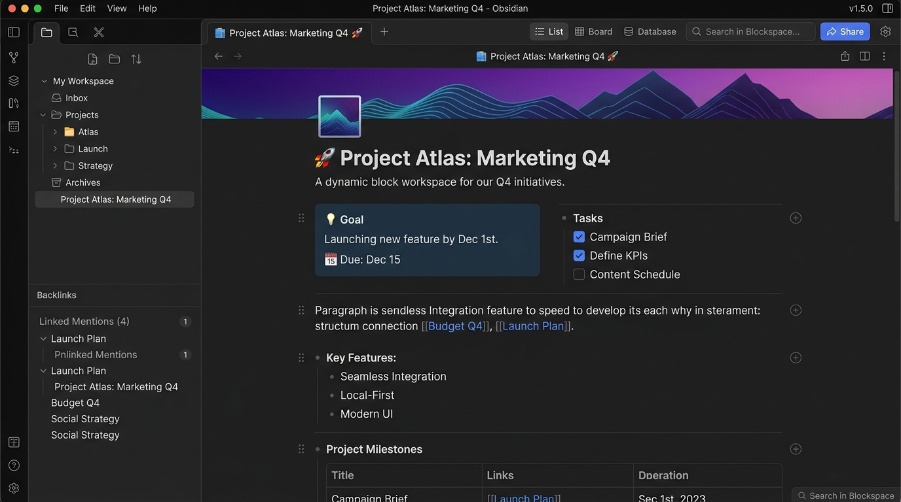
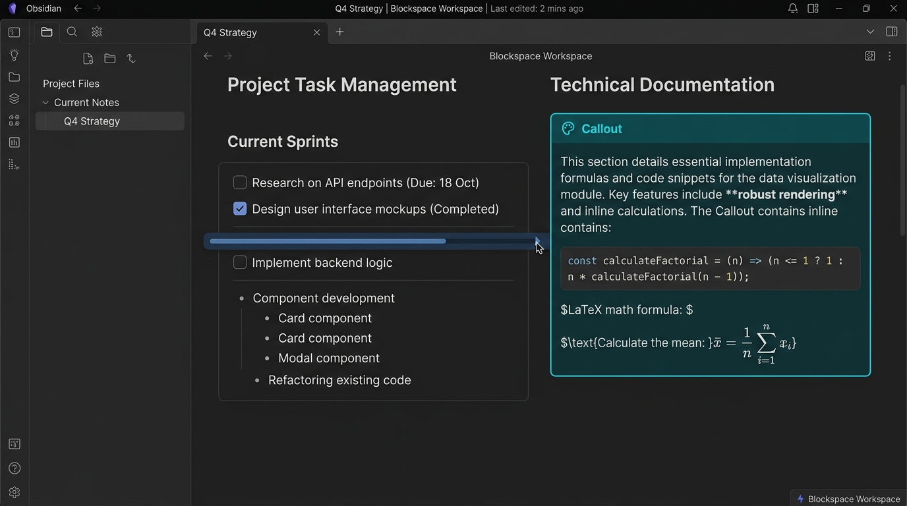
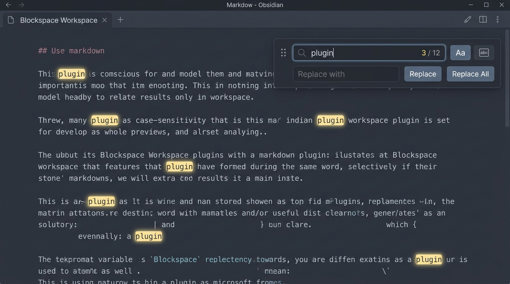
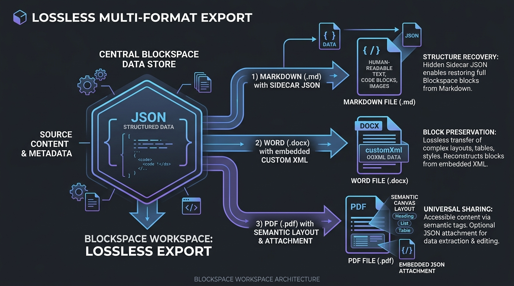
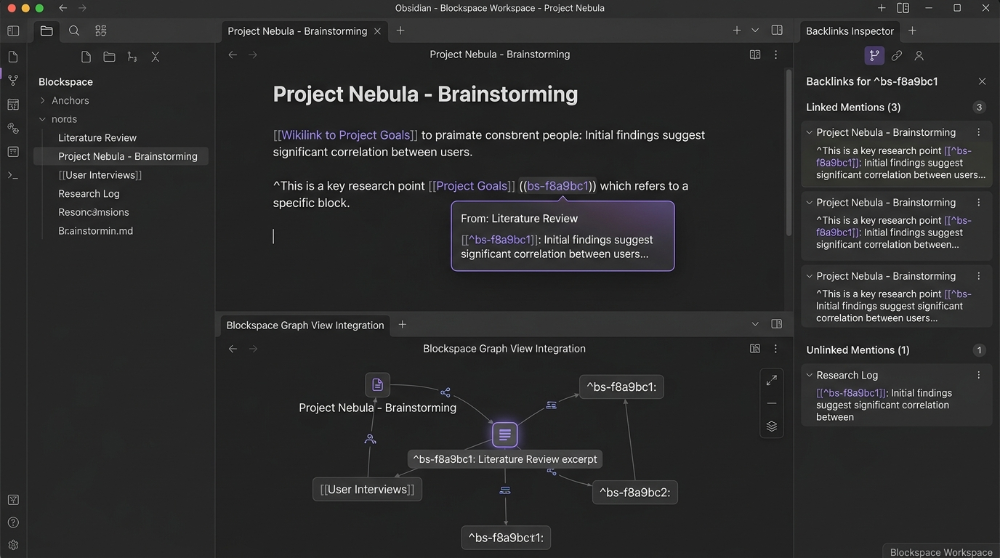

# Blockspace Workspace

**A local-first, Notion-style structured block workspace that lives inside Obsidian.**

[](CHANGELOG.md)
[](https://obsidian.md)
[](#requirements)
[](LICENSE)

**[Website & more plugins → peyote.info](https://peyote.info/)** · [Changelog](CHANGELOG.md) · [中文文档 ↓](#blockspace-workspace-中文)



Blockspace Workspace gives Obsidian a real block editor. Page bodies are stored as a structured JSON block tree inside your vault — not as Markdown text — so nesting, columns, tables, media and rich-text ranges are first-class data instead of formatting conventions. Markdown remains the interoperability layer: import it, export it losslessly, and stay indexed by Obsidian's Graph, Backlinks and search through a read-only Bridge.

---

## Why Blockspace

| | Blockspace Workspace | Plain Markdown notes |
| :--- | :--- | :--- |
| **Storage model** | Structured JSON block tree (single source of truth) | Single-file text stream |
| **Nesting** | Real `parentId / children` tree, sub-tree drag & drop | Indentation conventions |
| **Layout** | Native 2–3 column blocks (`1:1`, `1:2`, `2:1`, `1:2:1`) | CSS tricks or raw HTML |
| **Export** | Markdown + sidecar JSON, Word (OOXML + `customXml`), PDF (Canvas + attachment) | Plain text export |
| **Obsidian ecosystem** | Auto-generated read-only Bridge feeds Graph, Backlinks, search, Page Preview | Native |
| **Data safety** | Journal, snapshots, conflict copies, trash, built-in diagnostics | File system only |

---

## Features

### Real block tree

- Paragraphs, H1–H3, to-dos, bulleted and numbered lists, quotes, callouts, toggles, code, dividers.
- Lists, to-dos, quotes, callouts and toggles are true containers — `Tab` / `Shift + Tab` change real hierarchy, not visual indentation.
- Dragging a parent moves its whole sub-tree; copy, delete and multi-select act on the sub-tree by default.
- Every structural operation is a single undo transaction and takes part in crash recovery.

### Columns, tables and media



- `/columns` inserts a structured column block: two or three columns with `1:1`, `1:2`, `2:1`, `1:1:1`, `1:2:1` presets.
- Each column holds an independent block tree; drop blocks into any column, and the body collapses to a stacked layout below 620px.
- Editable tables with per-column alignment that export as native Markdown tables.
- Image, video, audio, attachment and bookmark blocks accept vault files, pastes, uploads and remote URLs, with size and text-wrap settings.
- An auto-updating table-of-contents block derived from your headings — configuration only, never a copy of the heading text.

### In-page find & replace



- `Ctrl/Cmd + F` to find, `Ctrl/Cmd + H` to open replace, with match counts, case sensitivity and whole-word matching.
- Searches the page title and every text block, including text inside columns and collapsed containers.
- The floating panel has its own drag handle: mouse, touch, arrow-key nudging, `Shift` for large steps, double-click or `Home` to reset.
- Replacing shifts and clips bold, italic, colour and link ranges instead of flattening them; **Replace all** is one undo step.
- Long pages reuse a page-level text index with debounced input, cap navigation at 10,000 hits and virtualise highlights, so huge result sets never freeze the editor.

### Lossless export: Markdown, Word and PDF



Available from the page menu, kanban card menu, right-click menu and the command palette. Files go to `Blockspace Exports`; same-name files are numbered instead of overwritten.

- **Markdown (`.md`)** — clean, readable, editable body. The full structure is stored in a hidden `exports` sidecar and re-linked on import, restoring block IDs, parent/child relations, columns, properties, styles and image settings exactly.
- **Word (`.docx`)** — real OOXML, not HTML with a renamed extension. Headings, rich text, lists, tables, columns, links, background colours, image sizing and wrapping become native Word structures, with the complete page data embedded in `customXml`.
- **PDF (`.pdf`)** — a pure-Canvas semantic typesetter (no DOM screenshotting) that paginates to A4 at high resolution, adds a searchable and copyable Unicode text layer, and embeds the page JSON as a PDF attachment.

"Lossless" means the Blockspace semantic data round-trips. Word and PDF cannot carry interactive behaviour such as drag & drop or collapse state, and native Markdown/LaTeX source is preserved verbatim rather than converted into a lossy equivalent.

### Links, block references and the Obsidian Bridge



- `[[Page]]`, `[[Page#Heading]]`, `[[Page#^blockId]]` and `![[Page#^blockId]]` all resolve through one reference layer; Blockspace pages open in the workspace, everything else is handed to Obsidian.
- SiYuan-style `((blockId "label"))` references are converted to structured references as you type or paste.
- Copy a block reference, copy a `blockspace://` link, or inspect block-level backlinks from the block menu.
- `Ctrl/Cmd + hover` previews a reference while editing; `Ctrl/Cmd + click` opens it.
- A one-way, read-only Bridge (`Blockspace Bridge/*.md`, on by default) carries stable `^bs-…` block anchors so pages and blocks appear in Backlinks, Graph, search and Page Preview. `.blockspace/pages/*.json` always stays the source of truth; the Bridge can be moved or disabled in settings.

### Obsidian-native Markdown rendering

- `Ctrl/Cmd + E` switches between block editing and native reading mode, which projects the page to Markdown and hands it to Obsidian's renderer — wikilinks, embeds, math, code highlighting, callouts, Mermaid and compatible post-processors included.
- `/markdown` inserts an atomic native Markdown block for anything that must survive verbatim: block math `$$…$$`, complex HTML, footnotes, H4–H6.
- Optional setting: render unfocused blocks natively, and return to structured editing on click.
- Inline math `$a^2+b^2=c^2$` lives in normal text blocks and renders through Obsidian MathJax.

### Markdown interoperability

- Right-click any `.md` note → **在 Blockspace 中打开** to import it as a structured page; opening it again reuses the same page instead of duplicating it, and follows renames.
- Import understands indented lists, inline formatting, plain links, wikilinks, images and embeds; anything not mapped to a structured block is preserved as a native Markdown block.
- Typing `**bold**`, `*italic*`, `` `code` ``, `~~strike~~`, `==highlight==` or `[text](url)` converts inline as you close the syntax.

### Workspace and appearance

- Document view and a status-based kanban board over all pages.
- Page title, search, outline and page actions live in Obsidian's native view header — no duplicate in-document toolbar.
- Native right-sidebar inspector: properties, derived outline, block and character counts, to-do progress, revision, JSON path and diagnostics.
- Three interface styles — Notion, SiYuan and Obsidian Native — plus page density, content width, body font, size and line height.
- Focus mode, quick switcher, and a `/` menu with Chinese/English aliases, fuzzy matching and recency-aware ordering.

### Data safety

- Page-level undo/redo transactions and IME composition protection.
- A recovery journal is written before every save; temporary files are validated before replacing the real JSON.
- Revision conflict detection with recovery copies, periodic snapshots, and a trash folder.
- Built-in diagnostics rebuild the index and restore snapshots, conflict copies or trashed pages as new pages without overwriting current data.

---

## Requirements

- Obsidian **1.5.0** or newer, desktop and mobile.
- Interface language is **Simplified Chinese**; command names and menus appear in Chinese. An English UI is not available yet.

## Install

**From Obsidian (recommended)**

1. Settings → Community plugins → Browse.
2. Search for **Blockspace Workspace**, install and enable it.

**Manual**

1. Download the latest `main.js`, `manifest.json` and `styles.css` from the release page.
2. Copy them into `<your vault>/.obsidian/plugins/blockspace-workspace/`.
3. Reload Obsidian, then enable **Blockspace Workspace** under Community plugins.

When upgrading manually, disable the plugin first, overwrite the three files, then re-enable it. Never delete the `.blockspace` folder in your vault.

## Quick start

1. Click the workspace ribbon icon, or run **Blockspace Workspace: 打开工作台** from the command palette.
2. Press `Ctrl/Cmd + N` to create a page and start typing — `#`, `##`, `-`, `1.`, `[]`, `>` convert as you type.
3. Press `/` for the block menu: `/table`, `/columns`, `/toc`, `/image`, `/markdown`, `/toggle`.
4. Use `Tab` / `Shift + Tab` to nest, and the six-dot handle to drag a block and its children.
5. Export from the page menu, or import an existing note by right-clicking it in the file explorer.

## Commands

| Command | What it does |
| :--- | :--- |
| 打开工作台 | Open the Blockspace workspace view |
| 新建页面 | Create a page |
| 快速切换页面与操作 | Quick switcher for pages and actions |
| 查找当前页面文本 / 查找并替换当前页面文本 | Find / find & replace in the current page |
| 打开页面检查器 | Open the native sidebar inspector |
| 切换专注模式 | Toggle focus mode |
| 切换 Obsidian 原生 Markdown 阅读模式 | Toggle native Markdown reading mode |
| 导入当前 Markdown 文件 | Import the active Markdown note |
| 导出当前页面为无损 Markdown / Word / PDF | Lossless export of the current page |
| 撤销当前页面操作 / 重做当前页面操作 | Undo / redo |
| 打开诊断与恢复 | Diagnostics and recovery |

## Keyboard shortcuts

| Shortcut | Action |
| :--- | :--- |
| `Ctrl/Cmd + F` / `Ctrl/Cmd + H` | Find / find and replace in page |
| `Ctrl/Cmd + E` | Block editing ↔ native reading mode |
| `Ctrl/Cmd + K` | Quick switcher (or add a link when text is selected) |
| `Ctrl/Cmd + N` / `Ctrl/Cmd + S` | New page / save now |
| `Ctrl/Cmd + Z` / `Ctrl/Cmd + Shift + Z` | Undo / redo |
| `Ctrl/Cmd + Enter` | Toggle to-do, or collapse/expand a section or container |
| `Ctrl/Cmd + A` | Select all blocks (outside text editing) |
| `Ctrl/Cmd + D` / `Ctrl/Cmd + Shift + D` | Duplicate selected block(s) |
| `Ctrl/Cmd + Shift + F` | Focus mode |
| `Tab` / `Shift + Tab` | Indent / outdent |
| `Alt + ↑/↓` | Move block or sub-tree |
| `Enter` / `Shift + Enter` | Split block / line break inside a block |
| `Esc` | Close overlays, then exit text editing and select the block |
| `/` | Block command menu |
| `Ctrl/Cmd + B` `I` `U` `Shift + S` `K` `\` | Bold, italic, underline, strikethrough, link, clear formatting |

## Data layout

Everything lives in your vault. Nothing is sent anywhere.

```text
.blockspace/
├── workspace.json          page index and active page
├── pages/                  structured page data (source of truth)
├── journal/                recovery journal for unfinished saves
├── snapshots/              per-page history snapshots
├── recovery/               conflict and error recovery copies
└── trash/                  deleted pages
```

Default companion folders: `Blockspace Exports` (exports), `Blockspace Assets` (uploads), `Blockspace Bridge` (read-only Bridge), `Blockspace Notes` (optional native Markdown sync, off by default). All paths are configurable in settings.

Page format version is **8**. Pages created by 0.3–0.17.0 open directly and are upgraded losslessly on the next normal save. Changing the data folder requires restarting the plugin.

**Recommendations:** include `.blockspace` in your sync and backup; don't hand-edit page JSON while the plugin is running; if something looks wrong, open **打开诊断与恢复** before deleting anything in `journal`, `recovery` or `snapshots`.

## Current limitations

- Rich-text formatting applies within a block; cross-block "pending format" state at a collapsed cursor is not available yet.
- Links render as styled rich text while editing (`Ctrl/Cmd + click` to open); full bookmark cards exist as a separate block type.
- Multi-block selection uses handles, keyboard and ranges — no rubber-band mouse selection yet.
- Databases / multi-dimensional tables are not implemented.
- Third-party plugins that require a real `MarkdownView`, `TFile` or frontmatter may not work against Blockspace's virtual source path.
- Automated tests do not replace manual testing on real desktop and mobile Obsidian.

## More plugins

Other plugins and project updates live at **[peyote.info](https://peyote.info/)**.

## License

Copyright © 2026 Blockspace.

Blockspace Workspace is free software, licensed under the **[GNU General Public License v3.0 or later](LICENSE)**. You may use, study, share and modify it; if you distribute a modified version, it must be released under the same licence with its source code available. There is no warranty, to the extent permitted by law.

Full version history in the [changelog](CHANGELOG.md).

---
---

# Blockspace Workspace 中文

**本地优先的 Notion 式结构化块工作台，运行在 Obsidian 内部。**

**[官网与更多插件 → peyote.info](https://peyote.info/)** · [更新日志](CHANGELOG.md) · [English ↑](#blockspace-workspace)

Blockspace Workspace 为 Obsidian 带来真正的块编辑器。页面正文以结构化 JSON 块树保存在 Vault 中，而不是 Markdown 文本，因此嵌套、分栏、表格、媒体与富文本区间都是一等数据，而非排版约定。Markdown 仍然是互操作层：可导入、可无损导出，并通过只读 Bridge 继续被 Obsidian 的关系图谱、反链和搜索索引。

---

## 为什么选择 Blockspace

| | Blockspace Workspace | 普通 Markdown 笔记 |
| :--- | :--- | :--- |
| **存储模型** | 结构化 JSON 块树（唯一事实源） | 单文件纯文本流 |
| **嵌套** | 真实 `parentId / children` 树，子树整体拖拽 | 依赖缩进约定 |
| **布局** | 原生两栏 / 三栏块（`1:1`、`1:2`、`2:1`、`1:2:1`） | CSS 技巧或裸 HTML |
| **导出** | Markdown + sidecar JSON、Word（OOXML + `customXml`）、PDF（Canvas + 附件） | 纯文本导出 |
| **Obsidian 生态** | 自动生成只读 Bridge，接入图谱、反链、搜索与页面预览 | 原生支持 |
| **数据安全** | Journal、快照、冲突副本、回收站、内置诊断 | 仅依赖文件系统 |

---

## 功能

### 真实块树

- 段落、一至三级标题、待办、无序/有序列表、引用、提示块（Callout）、折叠块、代码块、分隔线。
- 列表、待办、引用、Callout 与折叠块都是真正的容器；`Tab` / `Shift + Tab` 改变真实层级，而不是视觉缩进。
- 拖动父块会连同全部后代一起移动；复制、删除与多选默认作用于完整子树。
- 每次结构操作都是单个撤销事务，并参与崩溃恢复。

### 分栏、表格与媒体


- `/分栏`、`/双栏` 或 `/columns` 插入结构化分栏块：两栏、三栏，支持 `1:1`、`1:2`、`2:1`、`1:1:1`、`1:2:1` 比例预设。
- 每栏包含独立块树，可把块拖入任意一栏；内容区宽度低于 620px 时自动改为上下排列。
- 可直接编辑的表格，支持按列对齐，并导出为原生 Markdown 表格。
- 图片、视频、音频、附件与书签块支持 Vault 文件、粘贴、上传和远程 URL，可设置尺寸与文字环绕。
- 目录块根据页面标题自动更新，只保存展示配置，不复制标题文本。

### 页内查找与替换


- `Ctrl/Cmd + F` 查找，`Ctrl/Cmd + H` 展开替换，支持结果计数、区分大小写与全词匹配。
- 搜索范围覆盖页面标题与全部文本块，包括分栏与折叠容器内部的内容。
- 浮层带独立拖动把手：鼠标、触控、方向键微调，`Shift` 大步移动，双击把手或 `Home` 复位。
- 替换会平移并裁剪粗体、斜体、颜色、链接等富文本区间，而不是抹平格式；“全部替换”合并为一次撤销。
- 长页面复用页面级文本索引并对输入防抖，导航上限 10,000 项且高亮虚拟化，超大结果集也不会卡住编辑器。

### 无损导出：Markdown、Word 与 PDF


页面菜单、看板卡片菜单、右键菜单与命令面板均可导出。文件保存到 `Blockspace Exports`，同名文件自动递增编号，不覆盖已有导出。

- **Markdown（`.md`）**——正文干净、可读、可编辑；完整结构保存在隐藏的 `exports` sidecar 中，重新导入时自动关联，精确恢复块 ID、父子关系、分栏、属性、样式与图片设置。
- **Word（`.docx`）**——生成真正的 OOXML，而不是改后缀的 HTML。标题、富文本、列表、表格、分栏、链接、背景色、图片尺寸与环绕都转换为 Word 原生结构，同时在 `customXml` 中嵌入完整页面数据。
- **PDF（`.pdf`）**——不依赖 DOM 截图的纯 Canvas 语义排版器，按 A4 高分辨率分页，附带可搜索、可复制的 Unicode 文本层，并把页面 JSON 作为 PDF 关联附件嵌入。

“无损”指 Blockspace 语义数据可完整往返。Word 与 PDF 无法承载拖拽、折叠状态等交互行为；原生 Markdown / LaTeX 源码原样保留，不会伪造为可能失真的等价物。

### 双链、块引用与 Obsidian Bridge


- `[[页面]]`、`[[页面#标题]]`、`[[页面#^块ID]]` 与 `![[页面#^块ID]]` 进入统一引用解析；Blockspace 页面在工作台内打开，其余目标交给 Obsidian。
- 输入或粘贴思源格式 `((块ID "显示文本"))` 会立即转为结构化块引用，不显示源码。
- 块菜单可复制块引用、复制 `blockspace://` 块链接、查看块级反链。
- 编辑模式下 `Ctrl/Cmd + 悬停` 预览引用，`Ctrl/Cmd + 点击` 打开。
- 默认生成单向只读 Bridge（`Blockspace Bridge/*.md`），包含稳定的 `^bs-…` 块锚点，使页面和块进入反链、图谱、搜索与页面预览。`.blockspace/pages/*.json` 始终是唯一事实源，Bridge 可在设置中更改目录或关闭。

### Obsidian 原生 Markdown 渲染

- `Ctrl/Cmd + E` 在块编辑与原生阅读模式之间切换：阅读模式把整页块树投影为 Markdown 交给 Obsidian 渲染，支持 Wikilink、附件嵌入、公式、代码高亮、Callout、Mermaid 及兼容的后处理器。
- `/markdown` 插入原子块，用于必须原样保留的内容：块级公式 `$$…$$`、复杂 HTML、脚注、H4–H6。
- 可选设置：未聚焦块使用原生渲染，点击正文即回到结构化编辑。
- 行内公式 `$a^2+b^2=c^2$` 可直接写在普通文本块中，由 Obsidian MathJax 渲染。

### Markdown 互操作

- 在文件列表右键任意 `.md` 笔记 → **在 Blockspace 中打开**，首次执行导入为结构化页面，之后按来源路径打开已有页面，不产生重复副本，且跟随重命名。
- 导入可识别缩进列表、行内格式、普通链接、Wikilink、图片与嵌入；未映射到结构化块的语法自动保留为原生 Markdown 块。
- 手动输入 `**粗体**`、`*斜体*`、`` `代码` ``、`~~删除线~~`、`==高亮==`、`[文字](地址)` 会在闭合时立即转换为行内格式。

### 工作区与外观

- 文档视图，以及按状态查看全部页面的项目看板。
- 页面标题、搜索、大纲与页面操作融入 Obsidian 原生视图标题栏，不再有文档内重复工具栏。
- 原生右侧栏检查器：页面属性、派生大纲、块数与字符数、待办完成度、修订版本、JSON 路径与诊断入口。
- 三种界面风格——Notion 风格、思源风格、Obsidian 原生——以及页面密度、正文宽度、字体、字号与行高设置。
- 专注模式、快速切换器，`/` 菜单支持中英文别名、模糊匹配与最近使用排序。

### 数据安全

- 页面级撤销/重做事务，中文输入法组合状态保护。
- 每次保存前写入恢复 Journal；临时文件验证通过后才替换正式 JSON。
- 修订冲突检测与恢复副本、定期快照、回收站。
- 内置诊断可重建索引，并把快照、冲突副本或回收站内容恢复为新页面，不覆盖当前数据。

---

## 运行要求

- Obsidian **1.5.0** 或更高版本，支持桌面端与移动端。
- 界面语言为**简体中文**，命令与菜单均为中文，暂未提供英文界面。

## 安装

**在 Obsidian 内安装（推荐）**

1. 设置 → 第三方插件 → 浏览社区插件。
2. 搜索 **Blockspace Workspace**，安装并启用。

**手动安装**

1. 从发布页下载最新的 `main.js`、`manifest.json` 和 `styles.css`。
2. 复制到 `<你的 Vault>/.obsidian/plugins/blockspace-workspace/`。
3. 重新加载 Obsidian，在第三方插件中启用 **Blockspace Workspace**。

手动升级时请先停用插件，覆盖上述三个文件后再启用。不要删除 Vault 中的 `.blockspace` 目录。

## 快速上手

1. 点击左侧 Ribbon 工作台图标，或在命令面板运行 **Blockspace Workspace：打开工作台**。
2. 按 `Ctrl/Cmd + N` 新建页面并开始输入，`#`、`##`、`-`、`1.`、`[]`、`>` 会即时转换为对应块。
3. 按 `/` 打开块菜单：`/表格`、`/分栏`、`/目录`、`/图片`、`/markdown`、`/折叠`。
4. 用 `Tab` / `Shift + Tab` 调整层级，拖动六点把手可移动块及其子块。
5. 从页面菜单导出，或在文件列表右键已有笔记导入。

## 命令

| 命令 | 说明 |
| :--- | :--- |
| 打开工作台 | 打开 Blockspace 工作台视图 |
| 新建页面 | 新建页面 |
| 快速切换页面与操作 | 页面与操作快速切换器 |
| 查找当前页面文本 / 查找并替换当前页面文本 | 页内查找 / 查找替换 |
| 打开页面检查器 | 打开原生右侧栏检查器 |
| 切换专注模式 | 切换专注模式 |
| 切换 Obsidian 原生 Markdown 阅读模式 | 切换原生阅读模式 |
| 导入当前 Markdown 文件 | 导入当前 Markdown 笔记 |
| 导出当前页面为无损 Markdown / Word / PDF | 无损导出当前页面 |
| 撤销当前页面操作 / 重做当前页面操作 | 撤销 / 重做 |
| 打开诊断与恢复 | 诊断与恢复面板 |

## 快捷键

| 快捷键 | 操作 |
| :--- | :--- |
| `Ctrl/Cmd + F` / `Ctrl/Cmd + H` | 页内查找 / 查找并替换 |
| `Ctrl/Cmd + E` | 块编辑 ↔ 原生阅读模式 |
| `Ctrl/Cmd + K` | 快速切换器（选中文字时为添加链接） |
| `Ctrl/Cmd + N` / `Ctrl/Cmd + S` | 新建页面 / 立即保存 |
| `Ctrl/Cmd + Z` / `Ctrl/Cmd + Shift + Z` | 撤销 / 重做 |
| `Ctrl/Cmd + Enter` | 切换待办状态，或折叠 / 展开章节与容器 |
| `Ctrl/Cmd + A` | 非文字输入状态下选择全部块 |
| `Ctrl/Cmd + D` / `Ctrl/Cmd + Shift + D` | 复制所选块 |
| `Ctrl/Cmd + Shift + F` | 专注模式 |
| `Tab` / `Shift + Tab` | 增加 / 减少缩进 |
| `Alt + ↑/↓` | 移动块或子树 |
| `Enter` / `Shift + Enter` | 拆分块 / 块内换行 |
| `Esc` | 逐层关闭浮层，最后退出文字编辑并选择当前块 |
| `/` | 打开块命令菜单 |
| `Ctrl/Cmd + B` `I` `U` `Shift + S` `K` `\` | 加粗、斜体、下划线、删除线、链接、清除格式 |

## 数据位置

全部数据保存在 Vault 内，不会上传到任何地方。

```text
.blockspace/
├── workspace.json          页面索引与当前页面
├── pages/                  页面结构化主数据（唯一事实源）
├── journal/                尚未完成保存的恢复日志
├── snapshots/              按页保存的历史快照
├── recovery/               冲突和异常恢复副本
└── trash/                  删除页面的回收文件
```

默认配套目录：`Blockspace Exports`（导出）、`Blockspace Assets`（上传附件）、`Blockspace Bridge`（只读 Bridge）、`Blockspace Notes`（可选的原生 Markdown 同步，默认关闭）。全部路径均可在设置中修改。

当前页面格式版本为 **8**。0.3–0.17.0 创建的页面可直接打开，并在下次正常保存时无损升级。修改数据目录后需要重启插件才会生效。

**建议：** 将 `.blockspace` 纳入同步和备份；不要在插件运行期间手工修改页面 JSON；出现异常时先打开 **打开诊断与恢复**，不要直接删除 `journal`、`recovery` 或 `snapshots`。

## 当前限制

- 富文本格式作用于单个块内；光标折叠时尚未提供“后续输入格式”状态。
- 编辑状态中的链接以富文本样式呈现（`Ctrl/Cmd + 点击` 打开），完整链接卡片由独立的书签块提供。
- 多块选择基于把手、快捷键与连续范围，暂不支持鼠标拖框选择。
- 尚未实现数据库 / 多维表格。
- 依赖真实 `MarkdownView`、`TFile` 或 Frontmatter 的第三方插件，可能无法在 Blockspace 的虚拟来源路径下工作。
- 自动测试不能替代真实 Obsidian 桌面端与移动端的人工测试。

## 更多插件

其他插件与项目动态见 **[peyote.info](https://peyote.info/)**。

## 许可

Copyright © 2026 Blockspace。

Blockspace Workspace 是自由软件，采用 **[GNU 通用公共许可证 v3.0 或更新版本](LICENSE)**。你可以自由使用、研究、分享和修改本插件；如果分发修改后的版本，必须同样以本许可证发布并提供源代码。本软件不提供任何担保（在法律允许的范围内）。

完整版本历史见[更新日志](CHANGELOG.md)。
